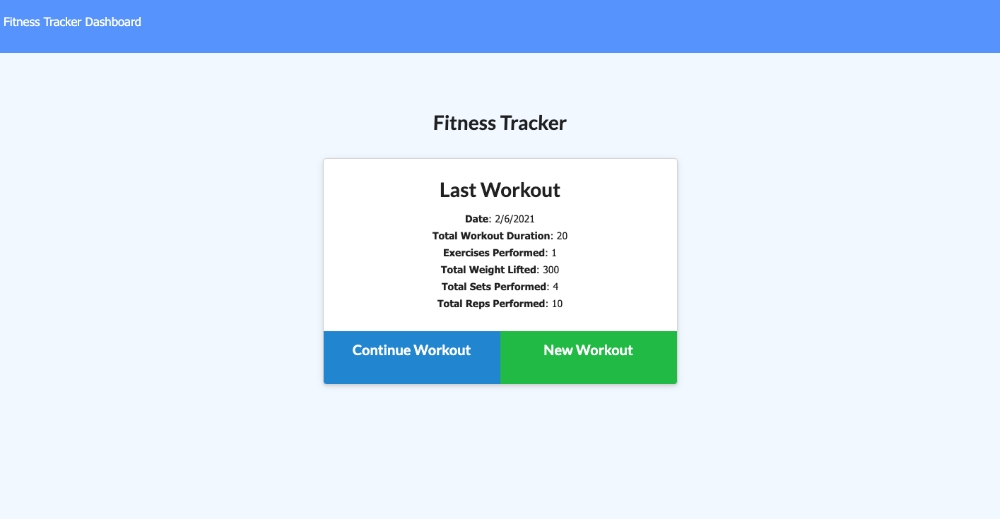
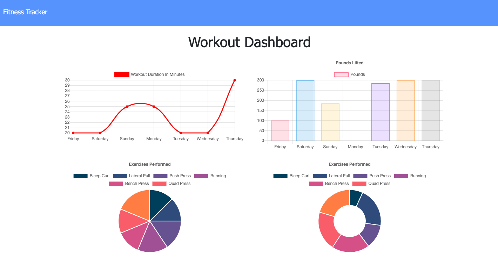

# Fitness Tracker

## Description
Reverse engineering a full-stack fitness application using mongoDB. The developer was given the front-end and was expected to create a Mongo database with a Mongoose schema and handle routes with Express.

## Table of Contents

* [Installation](#Installation)
* [Usage](#Usage)
* [Contributing](#Contributing)
* [License](#License)

## Installation

1. Navigate to the Github repo for the [Fitness Tracker](https://github.com/mollymccollumwx/fitness-tracker) and fork the repository. 
2. Copy the SSH key in the green "Code" button.
3. Clone the repo in your terminal.
4. Run `npm install` (make sure you have node.js installed first) to install the dependencies (express, mongoose). 
5. Run `npm run seed` in your terminal if you want to incorporate the seed data provided.

## Usage

With this application, you can:

1. Create new workouts in either the resistance or cardio categories
2. Update those workout by clicking "continue workout" on the homepage
3. View the last workout on the homepage including stats like "Total Workout Duration", "Total Weight Lifted", and "Total Sets Performed".
4. View a graphical representation of the last 7 workouts in the dashboard

## Contributing

This webpage was created during the Georgia Tech Coding Bootcamp. Thanks to the TA's and classmates that gave advice on approaching and fixing problems in the code. 

## License
MIT License

Copyright (c) [2021] [Molly McCollum]

Permission is hereby granted, free of charge, to any person obtaining a copy of this software and associated documentation files (the "Software"), to deal in the Software without restriction, including without limitation the rights to use, copy, modify, merge, publish, distribute, sublicense, and/or sell copies of the Software, and to permit persons to whom the Software is furnished to do so, subject to the following conditions:

The above copyright notice and this permission notice shall be included in all copies or substantial portions of the Software.

THE SOFTWARE IS PROVIDED "AS IS", WITHOUT WARRANTY OF ANY KIND, EXPRESS OR IMPLIED, INCLUDING BUT NOT LIMITED TO THE WARRANTIES OF MERCHANTABILITY, FITNESS FOR A PARTICULAR PURPOSE AND NONINFRINGEMENT. IN NO EVENT SHALL THE AUTHORS OR COPYRIGHT HOLDERS BE LIABLE FOR ANY CLAIM, DAMAGES OR OTHER LIABILITY, WHETHER IN AN ACTION OF CONTRACT, TORT OR OTHERWISE, ARISING FROM, OUT OF OR IN CONNECTION WITH THE SOFTWARE OR THE USE OR OTHER DEALINGS IN THE SOFTWARE.
